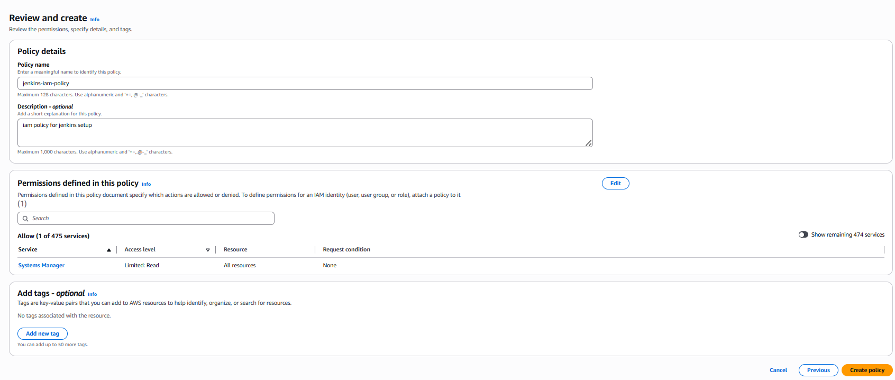
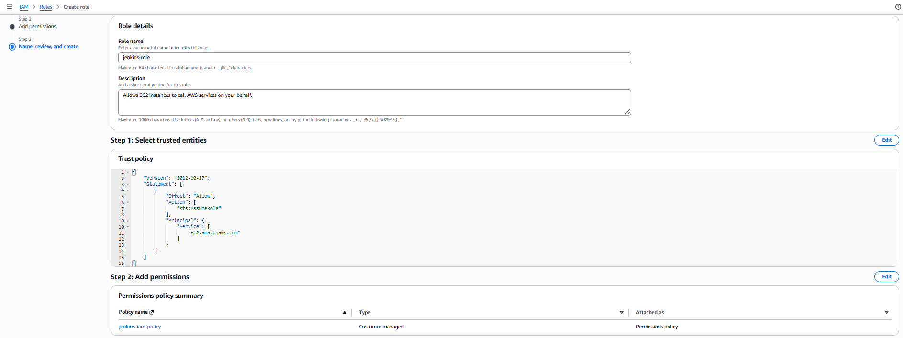
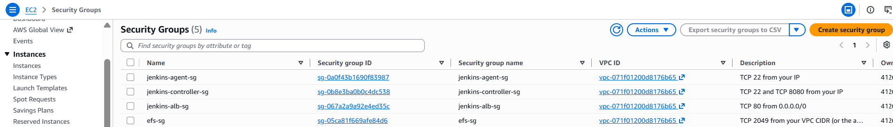
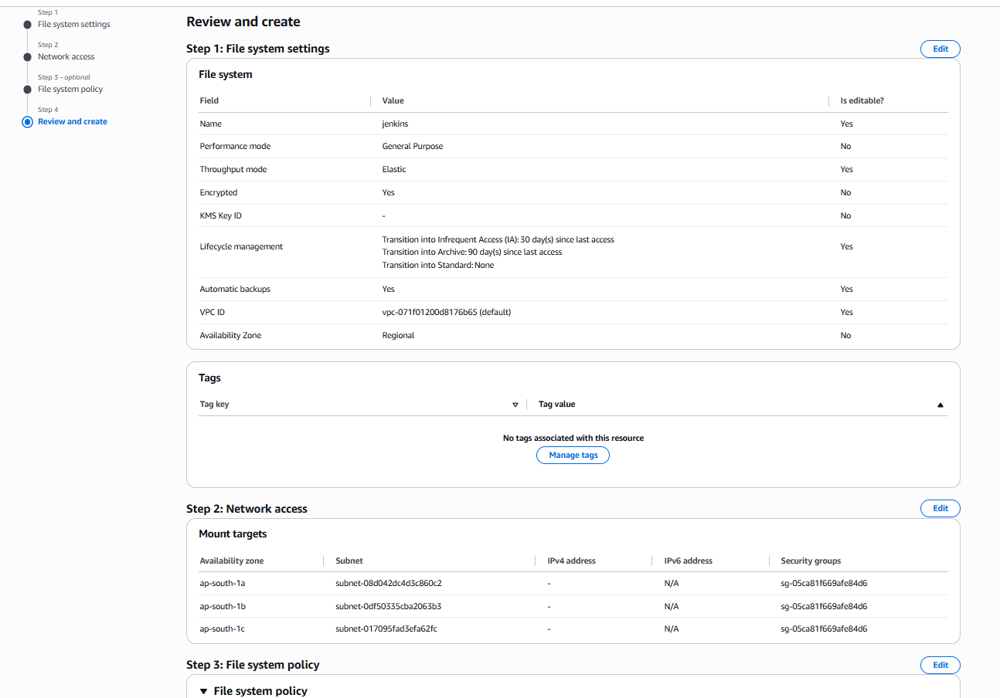
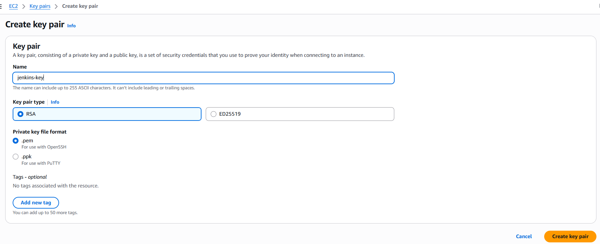
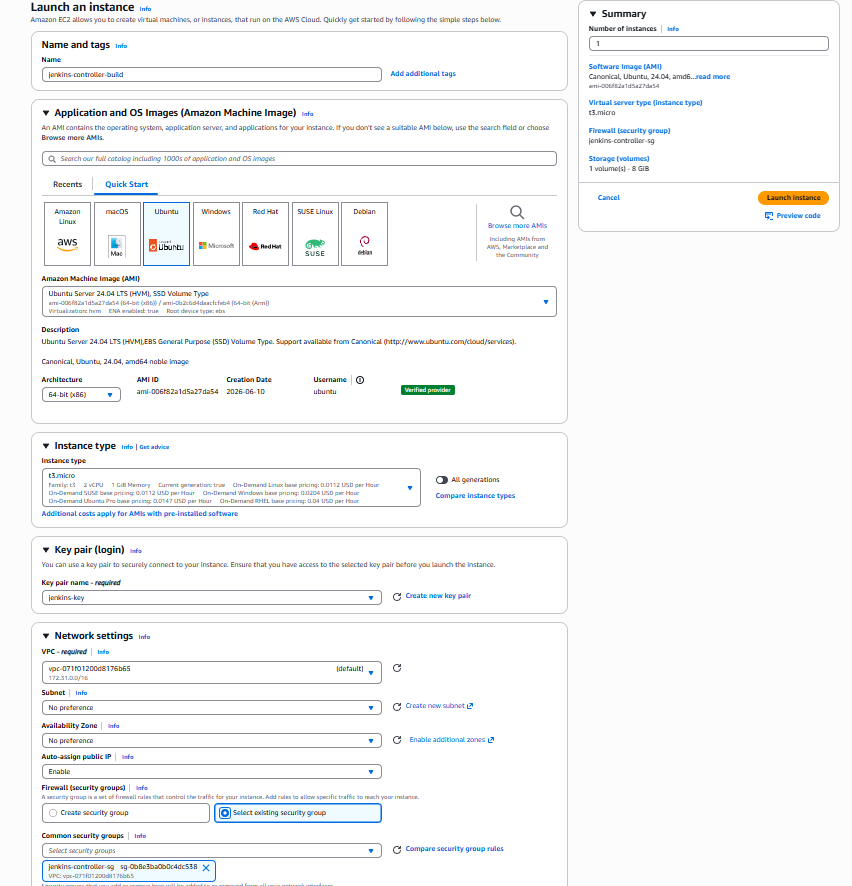
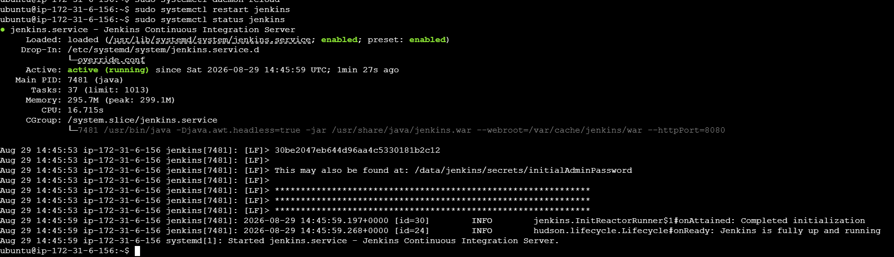
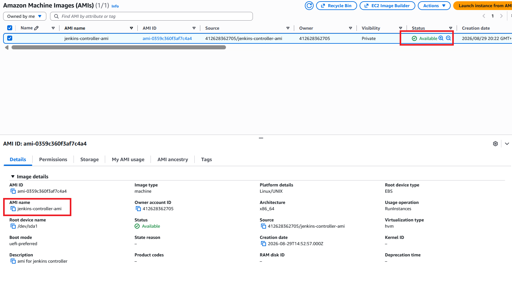
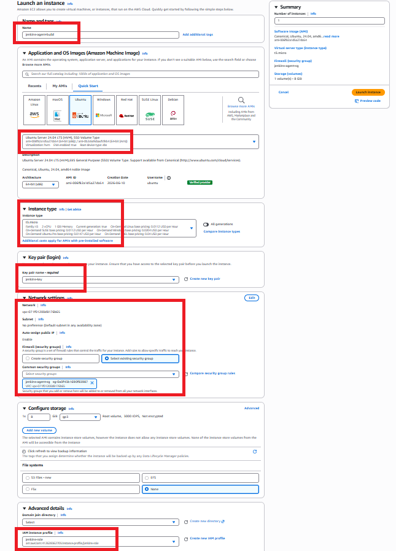

# Jenkins HA Setup on AWS - Manual Console Deployment

This is a pure AWS Management Console walkthrough for Jenkins Setup:
a Jenkins controller behind an ALB/ASG with `JENKINS_HOME` on EFS, plus
a separate Jenkins agent instance.

**One honest caveat:** the AWS Console can create every piece of *infrastructure*
by clicking (IAM, EFS, EC2, ALB, ASG). But installing software *inside* an
instance (Java, Jenkins, mounting EFS) has no console button for it - that part
needs a terminal session into the instance where you type the commands yourself.
This guide uses **EC2 Instance Connect** (a browser-based terminal built into the
EC2 console) for that, so you never need PuTTY, Git Bash, or a local SSH client.

## Prerequisites

- An AWS account with a VPC and at least 2–3 subnets already set up.
- Access to the AWS Management Console.

## Step 1 - Create the IAM role

*(Only needed if you want the agent to fetch its SSH key from SSM.
See the simplification note in Step 5 for skipping this entirely.)*

1. Go to **IAM → Policies → Create policy**.
2. Choose the **JSON** tab and paste:
   ```json
   {
     "Version": "2012-10-17",
     "Statement": [
       {
         "Effect": "Allow",
         "Action": ["ssm:GetParameter", "ssm:GetParameters", "ssm:GetParametersByPath"],
         "Resource": "*"
       }
     ]
   }
   ```
3. Name it `jenkins-iam-policy` and create it.



4. Go to **IAM → Roles → Create role** → Trusted entity type: **AWS service** →
   Use case: **EC2** → Next.
5. Attach `jenkins-iam-policy` → Next → name the role `jenkins-role` → Create role.
   (The console automatically creates a matching instance profile you'll attach at
   launch time.)



## Step 2 - Create security groups

Go to **EC2 → Security Groups → Create security group**, and create these four
(pick default VPC each time):

| Name | Inbound rules | Outbound |
|---|---|---|
| `efs-sg` | TCP 2049 from your VPC CIDR (or the agent/controller SGs) | All traffic |
| `jenkins-agent-sg` | TCP 22 from your IP (or 0.0.0.0/0 for a lab) | All traffic |
| `jenkins-controller-sg` | TCP 22 and TCP 8080 from your IP | All traffic |
| `jenkins-alb-sg` | TCP 80 from 0.0.0.0/0 | All traffic |



## Step 3 - Create the EFS filesystem

1. Go to **EFS → File systems → Create file system**.
2. Name: `jenkins`, VPC: your VPC, leave "Customize" defaults except:
   - Under **Network access**, set the security group for each mount target to
     `efs-sg`.
3. Create it, and once it's available, **copy the DNS name** shown on the
   filesystem's detail page (e.g. `fs-01e1859c291c96122.efs.ap-south-1.amazonaws.com`) —
   you'll mount this on the controller.



## Step 4 - Create a key pair

Go to **EC2 → Key Pairs → Create key pair**. Name it e.g. `jenkins-key`, format
`.pem`, and download it. You'll use this **same key pair** for both the controller
and agent instances — that's what lets the controller SSH into the agent with no
extra setup (see Step 5).



## Step 5 - Build the controller AMI

1. **EC2 → Instances → Launch instance.**
   - Name: `jenkins-controller-build`
   - AMI: Ubuntu Server 24.04 LTS
   - Instance type: `t3.micro` (or `t3.small`)
   - Key pair: `jenkins-key`
   - Network: default VPC/subnet, security group `jenkins-controller-sg`
   - Advanced details → IAM instance profile: leave blank (the controller doesn't
     need one - only the agent does, and only if you're doing the SSM trick)
   - Launch it.



2. Select the running instance → **Connect → EC2 Instance Connect → Connect**.
   This opens a terminal in your browser, logged in as `ubuntu`.

3. Run these commands one by one (replace `<EFS-DNS-NAME>` with the value from
   Step 3):

   ```bash
   sudo apt update -y
   sudo apt install -y nfs-common curl unzip
   sudo apt-get install -y fontconfig openjdk-21-jre

   # Mount EFS
   sudo mkdir -p /data
   sudo mount -t nfs4 -o nfsvers=4.1 <EFS-DNS-NAME>:/ /data
   echo "<EFS-DNS-NAME>:/ /data nfs4 nfsvers=4.1 0 0" | sudo tee -a /etc/fstab

   # Fetch key 
   curl -fsSL https://pkg.jenkins.io/debian-stable/jenkins.io-2026.key | sudo tee /usr/share/keyrings/jenkins-keyring.asc > /dev/null
   # add repo pointing at it
   echo "deb [signed-by=/usr/share/keyrings/jenkins-keyring.asc] https://pkg.jenkins.io/debian-stable binary/" | sudo tee /etc/apt/sources.list.d/jenkins.list > /dev/null

   sudo apt-get update
   sudo apt-get install -y jenkins

   # Move JENKINS_HOME onto EFS
   sudo systemctl stop jenkins
   sudo mkdir -p /data/jenkins
   sudo cp -a /var/lib/jenkins/. /data/jenkins/
   sudo chown -R jenkins:jenkins /data/jenkins
   sudo rm -rf /var/lib/jenkins

   # Point Jenkins at the new home directory
   sudo mkdir -p /etc/systemd/system/jenkins.service.d
   sudo bash -c 'printf "[Service]\nEnvironment=\"JENKINS_HOME=/data/jenkins\"\nWorkingDirectory=/data/jenkins\n" > /etc/systemd/system/jenkins.service.d/override.conf'

   sudo sed -i 's|^JENKINS_HOME=.*|JENKINS_HOME=/data/jenkins|' /etc/default/jenkins
   grep JENKINS_HOME /etc/default/jenkins

   sudo systemctl daemon-reload
   sudo systemctl enable jenkins
   sudo systemctl start jenkins
   sudo systemctl status jenkins
   ```

4. Confirm `status` shows `active (running)`.



5. Back in the EC2 console: select the instance → **Actions → Image and templates
   → Create image**. Name it `jenkins-controller-ami`. Wait for it to become
   `available` under **AMIs**.



6. **Terminate** the temporary `jenkins-controller-build` instance - the real
   controller instance will be launched from this AMI by the ASG in Step 8.

## Step 6 - Build the agent AMI

1. **Launch instance** again:
   - Name: `jenkins-agent-build`
   - AMI: Ubuntu Server 24.04 LTS
   - Key pair: **the same `jenkins-key`** used for the controller
   - Security group: `jenkins-agent-sg`
   - IAM instance profile: `jenkins-role` (only needed if fetching the key from
     SSM - skip if using the same-key-pair simplification below)



2. Connect via **EC2 Instance Connect** and run:

   ```bash
   sudo apt update -y
   sudo apt install -y openjdk-17-jdk python3 python3-pip curl unzip

   # AWS CLI
   curl "https://awscli.amazonaws.com/awscli-exe-linux-x86_64.zip" -o "awscliv2.zip"
   unzip awscliv2.zip
   sudo ./aws/install

   # Ansible
   sudo apt install -y ansible

   # Terraform + Packer
   curl -fsSL https://apt.releases.hashicorp.com/gpg | sudo gpg --dearmor -o /usr/share/keyrings/hashicorp-archive-keyring.gpg
   echo "deb [signed-by=/usr/share/keyrings/hashicorp-archive-keyring.gpg] https://apt.releases.hashicorp.com $(lsb_release -cs) main" | sudo tee /etc/apt/sources.list.d/hashicorp.list
   sudo apt update -y
   sudo apt install -y terraform packer
   ```

   **On the SSH trust step:** the original project fetches a public key from SSM
   Parameter Store and adds it to `authorized_keys` so the controller can SSH in.
   Since you launched this instance with the **same key pair** as the controller,
   that's already true — nothing more to do. (If you ever use a *different* key
   for the controller, just paste its public key manually:
   `echo "<controller-public-key-contents>" >> ~/.ssh/authorized_keys`.)

3. **Actions → Image and templates → Create image** → name it
   `jenkins-agent-ami`.

## Step 7 — Launch the real agent instance

**EC2 → Launch instance**, this time choosing:
- AMI: **My AMIs → `jenkins-agent-ami`**
- Key pair: `jenkins-key`
- Security group: `jenkins-agent-sg`
- Subnet: your choice

Launch it. This is your permanent Jenkins agent node — note its private/public IP
for later.

## Step 8 — Target group + Application Load Balancer

1. **EC2 → Target Groups → Create target group.**
   - Target type: Instances
   - Protocol/port: HTTP / 8080
   - VPC: your VPC
   - Health check path: `/login`
   - Create it (don't register any instances yet — the ASG will do that).

2. **EC2 → Load Balancers → Create load balancer → Application Load Balancer.**
   - Name: `jenkins-alb`
   - Scheme: Internet-facing
   - VPC + at least two subnets
   - Security group: `jenkins-alb-sg`
   - Listener: HTTP : 80 → forward to the target group from step 1
   - Create it.

## Step 9 — Launch template + Auto Scaling Group

1. **EC2 → Launch Templates → Create launch template.**
   - Name: `jenkins-controller-lt`
   - AMI: **My AMIs → `jenkins-controller-ami`**
   - Instance type: `t2.small` or similar
   - Key pair: `jenkins-key`
   - Security group: `jenkins-controller-sg`
   - Auto-assign public IP: enabled (in network interface settings)

2. **EC2 → Auto Scaling Groups → Create Auto Scaling group.**
   - Name: `jenkins-controller-asg`
   - Launch template: `jenkins-controller-lt`
   - VPC + subnets (same as the EFS mount targets)
   - Attach to an existing load balancer target group → select the one from
     Step 8
   - Desired/min/max capacity: **1 / 1 / 1**
   - Health checks: enable ELB health checks
   - Create the ASG. It will launch one controller instance from the AMI.

## Step 10 — Access Jenkins

1. **EC2 → Load Balancers → `jenkins-alb`** → copy the **DNS name**.
2. Browse to `http://<alb-dns-name>`.
3. To get the initial admin password: **EC2 → Instances**, find the instance the
   ASG launched (named `jenkins-controller`), connect via **EC2 Instance Connect**,
   and run:
   ```bash
   sudo cat /data/jenkins/secrets/initialAdminPassword
   ```
4. Paste that into the setup wizard and finish onboarding.

## Step 11 — Register the agent node in Jenkins

In the Jenkins UI: **Manage Jenkins → Nodes → New Node** → *Launch agents via SSH*.
- Host: the agent instance's IP (from Step 7)
- Credentials → Add → SSH Username with private key → paste the contents of your
  `jenkins-key.pem` file
- Remote root directory: `/home/ubuntu/agent`
- Host Key Verification Strategy: "Non verifying" is simplest for a lab setup

## Tearing it down

Delete in this order to avoid dependency errors:
1. Auto Scaling Group (this terminates the controller instance)
2. Launch template
3. Load balancer, then target group
4. Agent EC2 instance
5. Both AMIs (**Deregister**, then delete the underlying snapshots)
6. EFS filesystem
7. Security groups
8. IAM role, instance profile, and policy (if created)

## Notes

- Security groups above are permissive (SSH/8080 open to your IP or the internet)
  — fine for a personal lab, tighten before using this for anything real.
- Reusing the same key pair for both instances is a simplification over the
  original SSM-based approach — functionally equivalent for a single-agent setup,
  but if you add more agents with different owners/keys later, you'd want to go
  back to distributing keys via SSM or manually appending each one.