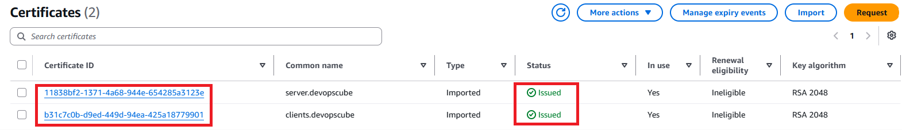
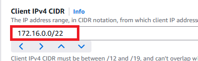
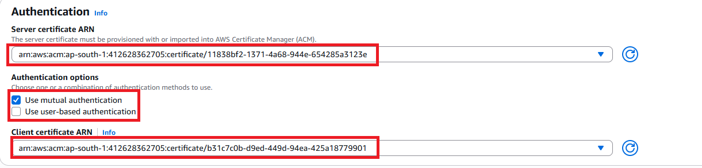
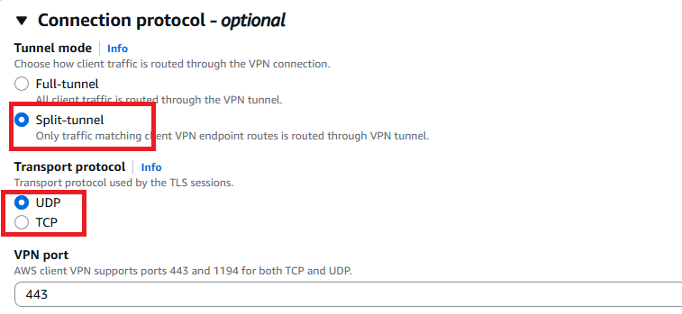
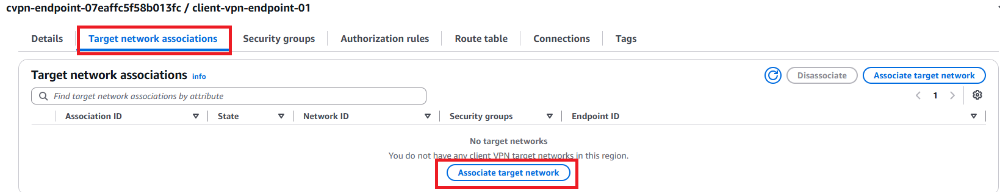
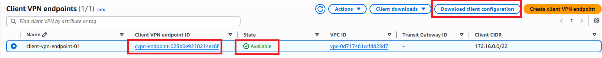
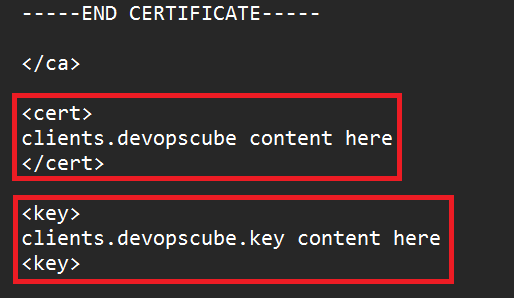
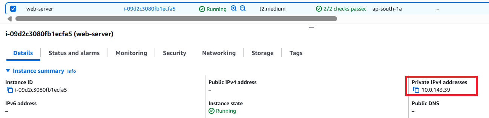
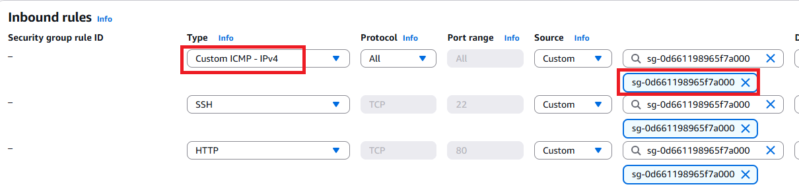
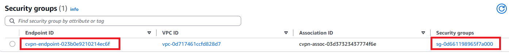

# AWS Client VPN Endpoint Setup

A step-by-step guide to set up an **AWS Client VPN Endpoint** for secure remote access to private resources inside a VPC (EC2 instances, internal services, etc.) - no bastion host, no public IPs needed on your targets.

---

## Need for VPN

To securely access cloud resources, large organizations commonly use **Site-to-Site VPN** or **AWS Direct Connect**. These services create a secure connection between an organization's **office or data center network** and AWS, creating a **hybrid cloud network**.

However, these solutions can be expensive and may require dedicated network infrastructure and expertise.
Another option is **Client-to-Site VPN**, where individual users securely connect from their laptops or computers to the AWS network. You can set this up yourself using tools like **OpenVPN on an EC2 instance**, but you are responsible for managing security, patching, maintenance, and availability.

Alternatively, you can use **AWS Client VPN**, a managed service where AWS handles the VPN infrastructure and reduces the administrative overhead.

---

## What is AWS Client VPN?

AWS Client VPN is a **fully managed VPN service** that allows remote users to securely access AWS resources. It creates an encrypted TLS tunnel between a client (your laptop) and AWS network, so you can reach private subnet resources by their **private IP**, as if you were on the same local network.
AWS runs and patches the VPN server side, you just configure the endpoint. The endpoint is managed by AWS and the users establish the connection using a **client VPN application (OpenVPN)**. 


**Key features:**
- Encrypted TLS connection between client and AWS
- Multi-platform clients (Windows, macOS, Linux, Android/iOS) via OpenVPN
- Mutual TLS (certificate-based) or user-based (Active Directory / SAML SSO) authentication
- Certificates managed via AWS Certificate Manager (ACM)
- Split-tunnel or full-tunnel routing modes
- Auto-scales with number of client connections


**Why not alternatives?**
| Option | Notes |
|---|---|
| Site-to-Site VPN / Direct Connect | Needs physical VPN hardware, expensive, org-scale |
| Self-managed OpenVPN on EC2 | You own patching, scaling, and HA |
| **AWS Client VPN** | Managed, pay-per-use, no infra to maintain |

---

## Architecture

```
                     ┌─────────────────────────────────────────┐
                     │                  AWS                    |
  Your Laptop        │   ┌───────────────────────┐             │
  (OpenVPN Client)–––|––►│  Client VPN Endpoint  │             │
  mTLS cert + key    │   │  (Client CIDR:        │             │
  Encrypted TLS      │   │   172.16.0.0/22)      │             │
  tunnel over UDP    │   └──────────┬────────────┘             │
                     │              │ Target Network           │
                     │              ▼                          │
                     │   ┌───────────────────────┐             │
                     │   │  Subnet 10.0.11.0/24  │ (VPN attach)│
                     │   │  (VPC 10.0.0.0/16)    │             │
                     │   └──────────┬────────────┘             │
                     │              │ Authorization Rule       │
                     │              ▼                          │
                     │   ┌───────────────────────┐             │
                     │   │  Subnet 10.0.4.0/24   │             │
                     │   │  Private EC2 instance │             │
                     │   │  (no public IP)       │             │
                     │   └───────────────────────┘             │
                     └─────────────────────────────────────────┘
```

**Trust model (mutual TLS):**
- A self-signed CA is created locally using Easy-RSA
- The CA signs both a **server certificate** and a **client certificate**
- Server cert + client cert + CA chain are imported into **ACM**
- Client VPN Endpoint is configured with the ACM server cert (for the server side) and the ACM client cert (as the trusted CA for client auth)
- On connect: client verifies server cert against the CA → server verifies client cert against the same CA → tunnel established

---

## Prerequisites

- An AWS account with a VPC already created (note your VPC CIDR, e.g. `10.0.0.0/16`)
- At least one private subnet in that VPC to associate as the "target network"
- A Linux-like shell to run Easy-RSA for **cert generation only** (use an EC2 Ubuntu box or WSL — **not plain Git Bash on Windows**, since the Easy-RSA scripts and OpenSSL paths don't play well with Windows path/line-ending handling). This is the one unavoidable terminal step — AWS Console has no built-in certificate generator, so certs must be created this way before you can import them.
- [OpenVPN client](https://openvpn.net/community-downloads/) installed on your workstation

---

## Step-by-Step Setup

### Step 1 — Generate CA, server, and client certificates (Easy-RSA)

Run on a Linux shell (EC2/WSL):

```bash
git clone https://github.com/OpenVPN/easy-rsa.git
cd easy-rsa/easyrsa3

./easyrsa init-pki
./easyrsa build-ca nopass                               # creates the CA
./easyrsa build-server-full server.devopscube nopass    # server cert/key
./easyrsa build-client-full clients.devopscube nopass   # client cert/key
```

Collect everything into one folder:

```bash
mkdir ~/certs
cp pki/ca.crt ~/certs
cp pki/issued/server.devopscube.crt ~/certs
cp pki/private/server.devopscube.key ~/certs
cp pki/issued/clients.devopscube.crt ~/certs
cp pki/private/clients.devopscube.key ~/certs
```

> To add more clients later, repeat `build-client-full <name> nopass` with a different name.

### Step 2 - Import certificates into ACM

You'll import two separate certificates: one for the server, one for the client. Do this from the region where you plan to create the VPN endpoint (switch region in the top-right of the console first).

**Open each cert/key file** (`server.crt`, `server.key`, `ca.crt`, `clients.devopscube.crt`, `clients.devopscube.key`) in a text editor so you can copy their contents — you'll paste these into the console form.

**Import the server certificate:**
1. Go to **AWS Console → Certificate Manager (ACM)**
2. Click **Import a certificate**
3. **Certificate body** - paste the full contents of `server.crt`
4. **Certificate private key** - paste the full contents of `server.key`
5. **Certificate chain** (optional but recommended) - paste the contents of `ca.crt`
6. Click **Next**, add a tag if you want (e.g. `Name = client-vpn-server-cert`), then **Import**

**Import the client certificate:**
1. Click **Import a certificate** again
2. **Certificate body** - paste the full contents of `clients.devopscube.crt`
3. **Certificate private key** - paste the full contents of `clients.devopscube.key`
4. **Certificate chain** - paste the contents of `ca.crt`
5. Click **Next**, tag it (e.g. `Name = client-vpn-client-cert`), then **Import**

Once done, both certificates should appear in the ACM console list with status **Issued**.



### Step 3 - Create the Client VPN Endpoint

Console path: **VPC → Virtual Private Network → Client VPN Endpoints → Create Client VPN Endpoint**

Fill in:
- **Name/description** - anything identifiable
- **Client IPv4 CIDR** - a range that does **not** overlap your VPC CIDR (e.g. VPC = `10.0.0.0/16`, client CIDR = `172.16.0.0/22`). AWS hands these IPs to connecting devices.

- **Authentication** — choose **mutual authentication**, select the server cert and client cert from ACM


- **Transport protocol** - UDP (recommended; lower latency)
- **Split-tunnel** - enable it, if you dont want to route *all* client traffic (including normal internet browsing) through the VPN. Otherwise you will not be able to access internet while connected to the VPN

- **Security group** - associate a security group (default, or a custom one scoped to only the ports you need); this becomes the "source" you can reference in your target EC2's security group rules
- **Optional Settings** - In real-world projects, private DNS servers may run in AWS. Their details are added to the Client VPN configuration to access AWS services using private DNS endpoints.

Click **Create Client VPN Endpoint**.

### Step 4 - Associate a target network (subnet)
We have created the Client VPN endpoint. Now, we need to add at least one VPC subnet as the target network for client connections.

Select the endpoint → **Target network associations** → add a private subnet from your VPC (e.g. `10.0.11.0/24`).

- This is the subnet the VPN traffic actually enters through
- AWS automatically creates the necessary route table entries
- If associating multiple subnets, use different Availability Zones for HA

### Step 5 - Add an authorization rule
Creating authorization rules will help to control the client's access to the network. We can specify which subnets and their resources that clients can access.

- Select the endpoint → **Authorization rules** → **Add authorization rule**

- Specify which subnet(s) clients are allowed to reach, e.g. `10.0.4.0/24`. Without a rule for a subnet, clients can't reach it even if it's routable.

### Step 6 - Configure the client `.ovpn` file

- Download the client configuration file from the endpoint's **Download client configuration** option.

- Open it in a text editor and paste in your client cert/key contents (from `~/certs`) inside the `<cert>` and `<key>` blocks. This is required becuase we opted for mutual SSL based VPN connectivity.


### Step 7 - Install OpenVPN and connect

- Download the [OpenVPN client](https://openvpn.net/community-downloads/) for your OS
- Import the edited `.ovpn` file
- Connect - a successful connection shows live connection stats in the client

### Step 8 - Test

- Launch a test EC2 instance **without a public IP** inside the authorized subnet (`10.0.4.0/24` in this example)

- Allow SSH/HTTP/ICMP in its security group (scoped to the VPN's security group or your client CIDR, not "anywhere," for anything beyond a quick test)


- From your workstation (while connected to the VPN), `ping` / `ssh` / `curl` the instance's **private IP**


If that works, you have private, encrypted access to your VPC without a bastion or public-facing resources.

---

## Key Concepts Reference

| Concept | Summary |
|---|---|
| **mTLS** | Two-way cert verification — client verifies server cert, server verifies client cert, both against the same CA |
| **User-based auth** | Alternative to mTLS: Active Directory (org has AD) or SAML 2.0 federated SSO |
| **TCP vs UDP** | UDP = lower latency, no delivery guarantee. TCP = reliable, slightly higher overhead. UDP is the common choice. |
| **Split tunnel** | Only traffic to authorized VPC subnets goes through VPN; everything else (general internet) goes direct |
| **Full tunnel** | All traffic routes through the VPN — more secure, but internet browsing slows down and needs handling |

---

## Cost Notes

- **$0.10/hour** per subnet association
- **$0.05/hour** per active client connection
- Default quota: 5 endpoints/region, 50 authorization rules/endpoint (both adjustable via quota request)
- Max ~7,000 concurrent connections per associated subnet

**Remember to delete the Client VPN Endpoint and disassociate target subnets when done testing** — it bills hourly even with no active connections, as long as a subnet is associated.

---

## Cleanup

1. Disassociate target subnet(s) from the endpoint
2. Delete authorization rules
3. Delete the Client VPN Endpoint
4. (Optional) Delete imported certs from ACM if no longer needed
5. Terminate any test EC2 instance